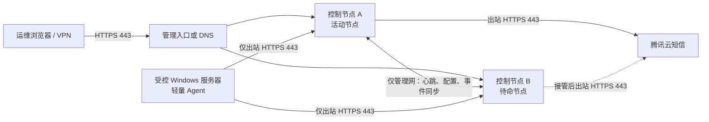

# 机房运维监控平台部署手册

**适用版本：** 当前仓库 `monitoring-platform` 原型版本  
**编写日期：** 2026-07-30  
**部署原则：** 监控组件不得与业务服务争抢资源；不在受控服务器安装无关运行时、数据库、容器平台或远程控制组件；所有生产变更先在非关键机器验证并可回退。

> **生产上线结论：当前源码不能直接部署到生产环境，也不能部署为真正的主备集群。**
>
> 当前 Release 构建、前端构建、4 项后端安全集成测试和 5 项前端测试均已通过，NuGet 漏洞扫描未发现已知漏洞。系统已经具备本地账号 Bearer 登录、`Admin / Operator / Viewer` 服务端授权以及 Agent Key 身份校验，但仍缺少真实探测、告警状态机、短信队列、Windows Agent、生产 HTTPS、数据保留和真实主备。请先完成本文第 3 节及 `开发计划.md` 的上线门禁。

本文将内容分成两类：

- **当前可执行的隔离验收部署**：仅用于修复构建问题后的功能验收，单节点、回环地址、无真实业务数据。
- **生产目标部署**：主备控制端与轻量 Agent 的准入条件和实施流程。此部分是实现完成后的上线基线，不是对当前缺失能力的替代实现。

## 1. 项目现状与部署边界

| 组件 | 当前实现 | 当前可用性 | 生产部署结论 |
| --- | --- | --- | --- |
| 控制台 | React 19 + Vite 6 静态前端 | `npm run build` 已通过 | 可生成静态文件；现有前端默认依赖开发代理 `/api -> 127.0.0.1:5090`，尚无生产反向代理配置。 |
| 中心 API | ASP.NET Core / .NET 10，EF Core SQLite | Release 构建及安全集成测试通过 | 已实现本地账号、Bearer、RBAC、登录限流和审计身份；生产 HTTPS 与请求级通用限流待补。 |
| 数据库 | 单个 `backend/Data/monitoring.db` | 本地开发存储 | 每个节点独立 SQLite 文件，无复制、无备份任务、无冲突处理，不能作为主备共享数据。 |
| 主备状态 | `/api/ha` 明确返回 `single-node`、`failoverSupported: false` | 能正确暴露能力边界 | 尚无复制、租约或仲裁，不能部署双机。 |
| Agent 上报 | `POST /api/v1/agents/ingest`，使用主机绑定 Agent Key、序列号和范围校验 | 服务端契约可测试，没有客户端 | 没有安装包、一次性注册、配置下发、mTLS 或签名。不能在受控机安装。 |
| 被控机探测 | 无 | 无 | ICMP/TCP/HTTP、Windows 服务、事件日志等均未实现。 |
| 短信 | 腾讯云 SDK 单次发送适配 | 配置缺失时返回 503 | 没有通知调度、告警触发、重试、去重或权限隔离。 |

### 1.1 当前接口实际暴露范围

当前 API 包含登录与账号、资产 CRUD、事件处置、规则/通知策略更新、短信测试、审计读取和 Agent 指标上报接口。除 `/api/health` 和 `/api/auth/login` 外均要求认证，并在服务端执行角色授权。当前仍只允许开发环境回环监听，不得据此绕过生产 HTTPS、证书和管理网防火墙门禁。

开发启动配置只监听 `http://127.0.0.1:5090`，Vite 开发面板运行在 `http://127.0.0.1:5173`。这两个端口均为开发用途，不是生产端口设计。当前 API 也没有 `UseStaticFiles`，不能直接承载前端构建目录。

### 1.2 本项目明确不应部署的内容

以下组件与当前目标不匹配，禁止为了“方便部署”而安装到控制端或业务服务器：

- Docker、Kubernetes、Prometheus、Zabbix、ELK、Grafana、完整 SQL Server/MySQL。
- Node.js、npm、.NET SDK、编译工具链安装到被控业务服务器。
- WMI/DCOM 远程轮询、远程执行、远程重启、任意脚本执行、远程桌面代理。
- 在业务数据库执行巡检 SQL，或保存业务数据库高权限凭据。
- 开放被控服务器入站监听端口供监控端轮询。

受控服务器只允许部署完成安全评审后的轻量 Agent；它必须主动向控制端建立 HTTPS 出站连接，不监听入站端口。

## 2. 生产目标架构

生产形态应为两台独立控制节点和可选 Agent 的混合架构。控制节点应位于管理网，不能与数据库、应用或 Web 业务进程共机。两台节点应处于不同电源回路和尽量不同交换机路径，并由 UPS 供电。



### 2.1 节点角色和最低资源

| 项目 | 主控制节点 A | 备控制节点 B | 被控服务器 |
| --- | --- | --- | --- |
| 部署位置 | 独立管理 VM/物理机 | 独立管理 VM/物理机，不能与 A 同宿主机或同一单点电源 | 原业务服务器 |
| 推荐系统 | Windows Server 2019/2022 x64，或经测试的 Windows 11 Enterprise x64 | 与 A 一致 | Windows Server 2012/2012 R2/2016+，以 Agent 验证矩阵为准 |
| 起步资源 | 4 vCPU、8 GB RAM、系统盘 80 GB + 数据盘 100 GB | 同 A | 不新增 VM、数据库或运行时；仅 Agent 自身资源预算 |
| 常驻组件 | 已发布的中心端 Windows Service、静态站点或最小反代、Windows 证书存储 | 同 A | 仅已签名 Agent Windows Service |
| 禁止共机 | 生产数据库、核心业务、域控、文件服务器、开发工具 | 同 A | Node/.NET SDK、Docker、数据库、主动扫描器 |

100 GB 数据盘只是上线起步值，必须按最终采样周期、保留期和实际主机数测算。当前代码把所有指标写入单一 SQLite 文件，未实现按日分区、汇总和过期清理，不能依据方案中“30 天明细/一年汇总”的目标直接估算容量。

### 2.2 网络与防火墙最小放行

| 来源 | 目标 | 协议/端口 | 当前状态 | 生产准入要求 |
| --- | --- | --- | --- | --- |
| 运维 VPN/管理网段 | 控制台入口 | TCP 443 | 未实现 | 仅允许指定管理网段，TLS 1.2+，不开放公网。 |
| 受控机 Agent | A、B 控制端 | 出站 TCP 443 | Agent 未实现 | 被控机不开放入站端口；双目标上报或故障切换策略必须由 Agent 实现。 |
| A 与 B | 对方同步端点 | 固定 HTTPS 端口，例如 TCP 8444 | 未实现 | 仅两台节点互访，mTLS，防火墙白名单，不使用动态端口。 |
| A/B | 腾讯云 API | 出站 TCP 443 | SDK 已存在 | 仅活动节点可发送；CAM 子账号只授予短信发送权限。 |
| A/B | DNS、NTP、证书服务 | 按单位基础设施要求 | 环境相关 | 使用现有基础设施，不单独部署 DNS/NTP/CA。 |

**禁止开放：** 被控机的 135、139、445、3389、5985、5986 仅用于本项目；WMI/DCOM 动态端口；控制台 HTTP 明文端口；数据库端口；任意公网来源。若业务本身已有这些端口，不因为本平台新增放行规则。

## 3. 生产上线门禁

下列全部完成并留有测试记录前，不能将本系统接入生产业务服务器，也不能配置真实短信联系人。

### 3.1 必须修复的当前代码问题

1. 资产 `POST/PUT/DELETE` 路由、`ValidateHost` 和 `HostRequest` 的重复定义已移除。CI 必须持续执行干净构建，防止回归。
2. Release 构建和当前依赖安全修复已完成；CI 必须持续执行构建、测试和 `dotnet list package --vulnerable --include-transitive`，防止回归。
3. 本地账号、Bearer 和服务端角色授权已完成；上线前仍需验证生产引导管理员、令牌密钥持久化、TOTP 方案及账号恢复流程。
4. 配置 HTTPS、受信任证书、仅管理网监听和请求大小/速率限制；禁止 `AllowedHosts: "*"` 和匿名 HTTP 服务进入生产。
5. 不在仓库、`appsettings.json`、脚本历史或前端构建产物中保存腾讯云 `SecretKey`。使用受保护的 Windows 配置/证书存储或受控环境变量，并由运行服务的专用低权限账号读取。

### 3.2 主备必须补齐的能力

当前已移除伪造的 `/api/ha/failover`；正式主备至少需要：

1. 节点身份、双向 TLS、持续心跳和版本化的配置/事件复制。
2. 共享的、可复制的数据存储策略；不能复制或共享正在写入的 SQLite 文件，也不能用网络共享盘承载 SQLite WAL。
3. 单一活动通知租约和外部见证/仲裁，避免网络分区时 A、B 同时发送短信。
4. Agent 对两节点可验证的上报策略、重复数据幂等、事件指纹和恢复回放。
5. 主备切换、恢复回切、数据延迟、复制失败和仲裁不可用的可观测告警。
6. 断电、断网、双节点网络分区、恢复同步和备份恢复演练。双节点本身不是多数仲裁；没有第三见证时必须明确接受极端条件下的重复告警风险。

### 3.3 Agent 必须补齐的能力

当前仓库没有 Agent 可执行文件、服务定义或安装包。发布前必须提供经代码签名的 MSI/EXE，并至少具备：一次性短期注册令牌、mTLS 客户端证书、序列号/时间窗重放防护、签名更新、受限服务账号、卸载与回滚、滚动日志上限、禁用远程命令能力。接口设计文档中提到的 `/api/v1/agents/enroll` 和 `/api/v1/agents/config` 也尚未实现。

### 3.4 必须通过的验收门槛

- 对 3 至 5 台非关键业务服务器连续灰度运行 7 天，只记录告警，不发送真实短信。
- Agent 的 1 分钟平均 CPU 小于 0.2%，工作集不高于 25 MB，网络流量不高于 50 KB/分钟，且不产生持续业务磁盘写入。
- 采集使用 PDH/Win32/SCM/事件日志的只读接口；CPU/内存/网卡默认 15 秒、磁盘/事件默认 60 秒，并带随机抖动。未通过压测前不得缩短周期。
- 安装、升级、卸载无需重启服务器，不停止、不重启、不修改业务服务，不添加启动脚本或计划任务。
- 主节点失联后备节点接管通知；恢复后不得漏失或重复写入处置记录。故障、分区和恢复测试均有记录。
- 备份还原演练成功；任何单节点故障均不影响另一节点读取完整的资产、配置、事件和审计数据。

## 4. 当前版本的隔离验收部署

本节仅允许在**非生产、无业务数据、与生产网络隔离**的 Windows 验收机执行。其目的为验证修复后的 API 和前端，不是生产发布流程。

### 4.1 前置条件

- 一台 Windows 验收机；不应使用业务服务器或控制端候选机。
- .NET 10 SDK（仅构建/验收期需要）与 Node.js LTS（仅构建前端需要）。生产控制端应使用发布产物或自包含服务，不保留 SDK/Node 构建环境。
- 本仓库工作副本；不复制已有 `backend/Data/monitoring.db` 到生产。
- 无真实腾讯云密钥和真实联系人号码。

### 4.2 构建前修复和校验

在 `D:\code\yunwei\monitoring-platform\backend` 中执行：

```powershell
dotnet build .\MonitoringPlatform.Api.csproj --no-restore
```

仅在输出无错误后继续。再在 `D:\code\yunwei\monitoring-platform` 执行：

```powershell
npm ci
npm run build
```

前端构建结果位于 `dist\`。当前构建已通过，但主 JS 压缩后约 622 KB，构建工具给出大于 500 KB 的告警；它不会影响当前验收，但正式发布前应使用按页面拆分来降低首次加载。

### 4.3 单节点启动与健康检查

仅用于隔离验收，API 必须保持回环监听：

```powershell
$env:ASPNETCORE_URLS = 'http://127.0.0.1:5090'
dotnet run --project .\backend\MonitoringPlatform.Api.csproj --no-build
```

新开一个 PowerShell 窗口，检查：

```powershell
Invoke-RestMethod http://127.0.0.1:5090/api/health
```

期望返回 `status: healthy` 和 UTC 时间。前端开发预览可使用 `npm run dev`；Vite 会将 `/api` 转发到本机 `127.0.0.1:5090`。完成验证后停止两个进程。不要将 Vite 开发服务器、`run-api.cmd` 或 5090/5173 端口作为生产服务安装。

### 4.4 当前版本的数据注意事项

首次启动会自动写入示例主机、事件、规则、通知策略、主备状态和指标。`backend/Data/monitoring.db`、`-wal`、`-shm` 文件均属于验收数据，不能作为生产初始化数据，也不应在运行时手工复制、覆盖或同步。

## 5. 生产控制端部署流程（待上线门禁通过后）

本节是已具备第 3 节能力的发布包的操作基线。它不要求、也不允许在节点上编译源码。

### 5.1 发布前准备

1. 为 A、B 分别准备固定管理 IP、DNS 名称、不同虚拟化宿主机/供电路径、受控管理账号和数据盘。
2. 由安全团队签发控制台服务证书和节点间 mTLS 证书；私钥仅赋予平台服务账号读取权限。
3. 创建专用本地或域服务账号，例如 `svc_monitor`。该账号不得是本地管理员、域管理员或业务服务账号；仅授予安装目录、数据目录、日志目录和证书私钥的最小访问权限。
4. 使用最终发布的签名校验值核验安装包。在 A 先进行安装、健康检查和功能验收，再部署 B；整个过程不连接业务服务器。
5. 将腾讯云凭据以受保护配置方式注入 A、B，使用权限最小的 CAM 子账号。B 只在取得活动通知租约后允许发送。

### 5.2 目录与服务规范

建议目录结构如下，数据盘可为 `D:`；目录名称可按单位规范调整，但 A、B 必须一致：

```text
D:\MonitoringPlatform\app\        # 只读发布产物
D:\MonitoringPlatform\data\       # 受 ACL 保护的数据
D:\MonitoringPlatform\logs\       # 有大小和保留上限的滚动日志
D:\MonitoringPlatform\backup\     # 加密备份暂存，按保留策略清理
```

发布包应以 Windows Service 运行，配置为“自动（延迟启动）”和服务失败恢复；恢复操作只允许重启该监控服务，不能触碰业务服务。服务日志应限制单文件大小、保留份数和总量，并将日志写入专用数据盘。

控制台静态文件可由经过批准的最小 IIS 站点或中心端自身的 HTTPS 静态文件能力托管。二者只能选择一个，不要同时叠加多层反向代理。IIS 仅在单位既有标准要求时启用；不得为此安装数据库、PHP、Node 或其他 Web 平台。

### 5.3 A、B 安装顺序

1. **部署 A：** 安装已签名发布包、受保护配置和证书，启动服务，验证 `/api/health`、HTTPS 证书链、审计身份、数据库/复制健康和备份作业。
2. **部署 B：** 使用独立本地数据目录和节点身份安装。验证 B 不持有通知租约、与 A 的复制延迟在阈值内、B 可读取同步后的资产和事件。
3. **配置入口：** 为浏览器配置健康检查的管理入口或明确的 A/B 访问地址。入口不得把无健康检查的流量盲目轮询到两个写入节点。
4. **计划内切换：** 在还没有受控机和真实短信前执行 A 到 B 的计划内切换；检查活动租约唯一、事件/配置版本一致、A 不再发送、B 成为唯一发送方。
5. **故障演练：** 模拟 A 服务停止和网络隔离；确认 B 在设计时间内接管。恢复 A 后验证数据回放和无重复通知。

所有步骤失败时，先停止新节点服务、移除其入口流量，再按发布包的回滚说明恢复上一已验证版本。不得通过复制 SQLite 文件或手工编辑 `HaState` 进行回滚。

## 6. 被控服务器部署

### 6.1 当前版本：不得部署任何受控端软件

当前仓库没有 Agent 二进制、MSI、配置文件格式、注册接口或证书流程。因此现在唯一安全的操作是**不在业务服务器安装本项目任何组件**。不要自行用 PowerShell 定时任务、WMI、curl 脚本或第三方 exporter 模拟 Agent，这会绕过认证、资源限制和变更控制。

当前 API 的 `/api/v1/agents/ingest` 只是一个未鉴权的开发接口。它根据 `HostName` 找到已存在资产并写入 CPU、内存、磁盘、延迟及序列号，不能证明服务器身份，也不能采集真实指标。不得把它暴露给任何生产网络。

### 6.2 正式 Agent 的部署前检查

在 Agent 已实现并完成第 3 节验证后，对每台被控机执行以下只读核对：

1. 确认业务负责人批准安装窗口和回滚联系人；生产关键机按每批不超过 10 台灰度。
2. 记录基线：CPU、可用内存、磁盘 I/O、网络流量、业务延迟和当前 Windows 服务状态，至少持续 30 分钟。
3. 确认被控机可仅以出站 HTTPS 访问 A、B 的管理网地址；不增加任何入站防火墙规则。
4. 确认本机没有同名服务，系统盘和日志盘有足够空间，且安装包签名、哈希、版本、发行来源均已核验。
5. 确认注册令牌只绑定该主机、短时有效、一次使用；不要通过命令行历史、共享文档或未加密脚本传播令牌。

### 6.3 正式 Agent 的轻量安装要求

最终安装包应支持静默安装并由变更系统分发，例如厂家/项目发布的 MSI 使用标准 `msiexec` 静默参数。**具体产品名、服务名、安装参数和配置文件必须以实际签名安装包的发布说明为准；当前仓库没有该安装包，不能执行下列操作。**

安装后必须验证：

- 仅新增一个受限身份运行的监控 Agent 服务；没有计划任务、驱动、浏览器插件、远程控制服务或监听端口。
- Agent 仅以 HTTPS 主动上报，证书校验失败时停止上报并记录有限日志，不降级到 HTTP。
- 默认采集周期及随机抖动生效；高频指标使用性能计数器，事件日志和磁盘性能使用低频增量读取。
- 日志按大小和份数滚动，故障缓存有上限；网络中断不能无限堆积内存、磁盘或重试请求。
- 观察至少 30 分钟，Agent 的 CPU、内存、磁盘 I/O 和网络流量均未超过第 3.4 节预算，且业务指标没有劣化。

### 6.4 回滚与卸载

若安装后出现业务延迟、CPU/I/O 异常、网络异常或兼容性问题，应立即：停止 Agent 服务、从控制台将该主机置为维护/停用、保留有限日志和安装审计信息、按签名安装包提供的卸载方式卸载。卸载不得重启服务器、不得删除业务文件、不得影响业务服务。随后将该主机移出灰度批次，分析原因后才能再次部署。

## 7. 将被控服务器添加到控制台

### 7.1 当前可用的“资产登记”流程

修复 API 构建问题并在隔离验收环境启动后，控制台左侧进入“资产”，点击“添加服务器”，填写：

| 字段 | 当前 API 校验 | 填写规则 |
| --- | --- | --- |
| 服务器名称 | 必填，最长 64 字符 | 使用稳定、唯一的主机名；当前 API 会转成大写。未来 Agent 的身份应使用不可变主机 ID，不应仅依赖名称。 |
| IP 地址 | 必填，必须是 IPv4 或 IPv6 | 填管理网可达地址；不填 NAT 公网地址。 |
| 机房 | 必填，最长 64 字符 | 使用统一机房命名。 |
| 业务系统 | 必填，最长 64 字符 | 填业务归属，例如 `ERP`、`WEB`、`数据库`。 |

保存后系统会创建资产记录，初始状态为“未知”。这只完成资产台账登记，**不会在服务器上安装 Agent，不会自动发现服务器，也不会开始 ICMP/TCP/HTTP/服务检查**。当前版本不存在资产批量导入、服务器组、标签、负责人、操作系统、探针配置或停用 API；界面中相关内容多为原型展示。

### 7.2 API 登记方式（仅隔离验收）

没有浏览器界面时，可在本机 API 启动后使用下列请求验证资产登记。不要在生产网络使用，因为现有 API 没有认证：

```powershell
$body = @{
  name = 'UAT-WEB-01'
  ip = '10.20.30.41'
  room = '验收机房'
  service = '验收业务'
} | ConvertTo-Json

Invoke-RestMethod -Method Post `
  -Uri 'http://127.0.0.1:5090/api/hosts' `
  -ContentType 'application/json' `
  -Body $body
```

成功响应后，`GET /api/hosts` 可以查看该资产。重复主机名会返回冲突；有关联事件的资产不能删除。生产实现应添加“停用”而不是删除，以保留监控与审计历史。

### 7.3 正式接入流程（Agent 与控制台能力完成后）

1. 在控制台创建资产，生成与资产绑定的短期、一次性注册令牌；令牌应显示最少必要信息，使用后立即失效。
2. 在对应受控机安装已签名 Agent，写入 A/B HTTPS 地址、受控机 ID 和一次性令牌；不写入管理员密码或业务凭据。
3. Agent 完成 mTLS 注册后，控制台显示 Agent 版本、证书状态、最后心跳和采集耗时；资产状态从“未知”变为“已接入/健康”。
4. 只为该主机选择必要检查项：基础指标、关键 Windows 服务或已有业务 HTTPS 地址。默认不启用进程全量扫描、事件日志全量上传、WinRM、WMI/DCOM 和数据库检查。
5. 先以“记录不通知”运行 7 天，核对阈值、抖动、网络和资源基线；确认无误后才按通知策略启用严重告警。

## 8. 低负载运行基线

### 8.1 被控机采集基线

| 检查项 | 默认周期 | 实现要求 |
| --- | ---: | --- |
| CPU、内存、网卡速率 | 15 秒 | 使用轻量只读性能计数器，首次采集加入随机抖动。 |
| Agent 心跳 | 10 秒 | 合并到指标上报，批量/压缩小报文，不建立长时间高频轮询。 |
| 磁盘空间、磁盘性能 | 60 秒 | 只读取必要卷，不扫描文件系统。 |
| 指定 Windows 服务 | 30 秒 | 仅查询白名单服务，禁止枚举/上传全部服务和进程。 |
| 事件日志增量 | 60 秒 | 保存书签，只读取指定事件 ID 的增量，不导出完整日志。 |
| ICMP、TCP、HTTP/HTTPS | 10 至 15 秒 | 由控制端探测；先在少量主机测量，再逐批扩大。 |

不要为追求“实时”压缩这些周期。对高 I/O、老旧硬件或核心数据库服务器，先采用 30/60 秒级别周期，观察 72 小时后再决定是否缩短。

### 8.2 控制端运行基线

- 仅对已登记和启用的目标执行探测；采用并发上限、超时、随机抖动和指数退避，避免故障时形成探测风暴。
- 指标数据必须使用分区、汇总和到期清理；不对大表频繁 `DELETE`，不在 SQLite 单文件并发写入场景下横向扩容。
- 日志、指标、备份分别设置容量上限和告警阈值；数据盘达到 80% 前应告警，禁止耗尽系统盘。
- 短信必须按事件指纹去重、冷却和次数上限处理；测试短信使用专用测试号码。
- 监控服务自身重启只能处理本服务异常；不得将“自动修复”扩展为重启业务服务或服务器。

## 9. 日常检查、备份与演练

### 9.1 每日检查

1. A/B 服务、HTTPS 证书有效期、节点心跳、复制延迟、活动通知租约是否健康。
2. 数据盘、日志、备份空间与保留策略是否在阈值内。
3. Agent 在线率、版本分布、上报延迟、资源预算超限和注册/证书失败是否异常。
4. 短信通道请求结果、错误码、去重与失败重试是否正常；不得在日志中打印密钥或完整手机号。

### 9.2 备份要求

待数据层完成后，至少每日备份配置、资产、规则、事件、审计和必要指标汇总；备份文件加密并存放至与 A/B 不同的受控存储。备份任务应限速、错峰，不能在业务高峰执行。每季度在隔离环境执行一次恢复演练，验证恢复后的数据一致性和应用可启动性。

### 9.3 主备演练

每季度执行一次计划内切换和一次故障切换演练，检查活动节点唯一性、配置/事件版本、通知去重、恢复同步和回切。所有演练应使用维护窗口和测试联系人，不能以真实生产故障作为测试手段。

## 10. 上线批次与停止条件

建议顺序为：控制端隔离验收 -> A/B 主备演练 -> 3 至 5 台非关键机 7 天静默灰度 -> 每批不超过 10 台按业务组扩展 -> 关键业务机最后接入。每批完成后比较安装前后资源和业务延迟基线。

任一条件出现时，停止扩大范围并回退当前批次：

- Agent 或控制端超过 CPU、内存、网络、磁盘 I/O 预算。
- 业务响应时间、错误率、队列深度或数据库负载有明显恶化。
- 出现未授权访问、证书校验失败降级、明文传输、密钥泄露或异常端口监听。
- 发生重复/漏报、主备双活通知、数据复制不一致、备份/恢复失败。
- 控制端数据盘、日志或消息队列无上限增长。

## 11. 交付验收清单

- [ ] API 与前端在干净环境构建通过，依赖高危公告已处理。
- [ ] 所有管理 API 均完成认证、授权、审计、限流和 HTTPS。
- [ ] A/B 不共享 SQLite 文件，具备验证过的复制、仲裁、唯一通知租约和恢复流程。
- [ ] 发布包和 Agent 均已签名，服务账号、证书 ACL、网络白名单和日志限制完成核查。
- [ ] 受控服务器未安装无关运行时或工具，且没有为本项目开放入站端口。
- [ ] 灰度资源和业务基线满足第 3.4 节要求，卸载与回滚验证成功。
- [ ] 资产登记、Agent 注册、必要检查项和静默观察流程已跑通。
- [ ] 备份恢复、计划内切换、故障接管、网络分区和短信去重演练均通过。

---

### 审阅依据

- `backend/Program.cs`：当前 API、SQLite 文件路径、回环开发运行、匿名接口、Agent 上报字段、演示性 HA 状态与重复声明。
- `backend/MonitoringPlatform.Api.csproj`：.NET 10、EF Core SQLite、腾讯云 SDK 依赖。
- `backend/Properties/launchSettings.json` 与 `backend/run-api.cmd`：仅 `127.0.0.1:5090` 的开发配置。
- `vite.config.mjs` 与 `src/App.jsx`：Vite 开发代理、资产登记字段与控制台接口调用。
- `README.md`：项目已实现范围与明确的生产待办。
- `D:\code\yunwei\轻量化Windows机房运维监控平台方案.md`：目标轻量 Agent、主备、资源预算与安全原则。
